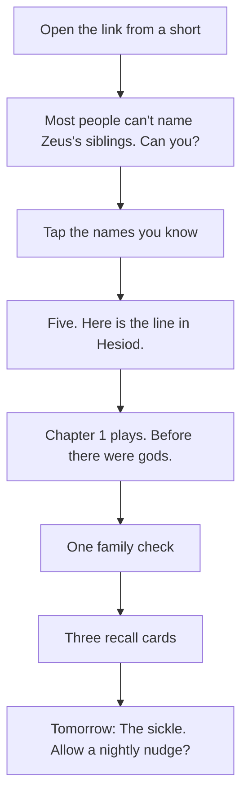
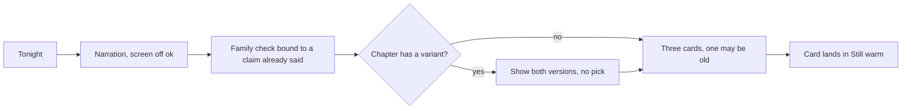

# Screens and flows

Five screens. A tab bar with three tabs, Tonight, Family, and Mythologies. Lesson and Battle push from Tonight.

## Screen inventory

| Screen | Purpose | Entry | Exit | Mockup |
|---|---|---|---|---|
| Tonight | Tonight's chapter and the review cards that are still warm. Three layouts under test. | Tab, notification, home-screen icon | Lesson, Battle on Sundays | `design/today-a.html`, `today-b.html`, `today-c.html` |
| Lesson | Narration with a scrolling transcript, one family check, the variant fork when the chapter has one, three recall cards. | Tonight | Back to Tonight | `design/lesson.html` |
| Family | The genealogy graph of the tradition so far. Tap a name for its one-line claim and cite. Variant edges stay visible. | Tab, any name in a lesson | Lesson of the tapped figure | `design/family.html` |
| Battle | Weekly timed recall over the cycle so far. Wrong answers show the source line. | Tonight on Sundays | Back to Tonight | `design/battle.html` |
| Mythologies | The shelf of traditions and epics, comparative weeks, seals, and the two Hearth+ prices. | Tab | Lesson 1 of a tradition | `design/mythologies.html` |

## First night

No account. No name. The chapter is the onboarding.

## A night

## Sunday

Battle replaces the chapter. Ten to twelve timed questions from claims the user has heard. Each miss shows the work and locator and comes back next week. Ten of twelve held, twice, earns the cycle seal.

## What every wrong answer looks like

Work, locator, one sentence in our words. "Homer, Iliad 15.187-193. Poseidon says the brothers drew lots." Never a red X alone. This is the rule that separates Hearth from a quiz database, so it has its own row here.
